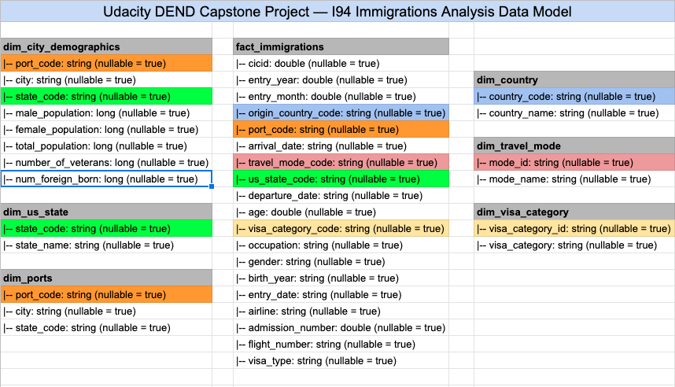

# Data Engineering Capstone Project

## US I94 Immigration Data Lake

### Project Summary
This project performs ETL operations on Udacity provided I94 immigration and demographics datasets using Pyspark. It generates a Star Schema in parquet file at the end following Data Lake's schema-on-read semantics.

### Scope
I plan to create a data lake using Pyspark about immigrants destinations in US. To achieve this, I've used I94 immigrations dataset along with US demographics dataset. Processed data lake tables could be used to analyse immigration trends at US destination cities and origin of the travelers. Output is generated in `Apache Parquet` columnar format for better performance on aggregation queries.

A few sample queries include:
- Which city was most visited in a specific month?
- From which country (or countries) travelers originate? Top countries of origin.
- Top countries from where students are coming?

### Datasets
Following datasets are used for this project:
- `I94 Immigration Data 2016`: This data comes from the US National Tourism and Trade Office.
    - Source: https://travel.trade.gov/research/reports/i94/historical/2016.html
    - Note: this data is behind a paywall but is provided by Udacity for this project.
    - Dataset consists of 12 files containing data for each month. Each file has around 3 million rows and 28 columns. A data dictionary explaining columns is also included at `data/I94_SAS_Labels_Descriptions.SAS`.
    - Sample CSV: `data/input/immigration_data_sample.csv`
    - NOTE: Data inside `sas_data` dir contains data for April 2016 and thus can also be used to perform this analysis. This dataset contains ~3MM rows which satisfies the requirement of at least 1MM rows in dataset.
- `U.S. City Demographic Data`: This data comes from OpenSoft.
    - Source: https://public.opendatasoft.com/explore/dataset/us-cities-demographics/export/

I've used these two datasets and both are in different formats i.e. sas, csv. 

### Data Exploration
I've noted some observations about I94 Immigrations data in Datasets section. This data contains many columns with empty values and I've dropped most of those in final fact table creation. `biryear` columns have some invalid values which are removed in cleaning.

US cities demographics data is pretty clean but have duplicate rows for cities which are later combined when creating city demographics dimensional table.

### Data Model
Here is the final Star Schema data model:

Ports, Country, Visa Category, Travel Mode and US state dimensional tables are extracted from `I94_SAS_Labels_Descriptions.SAS` file. City demographics dimension table is created by combining ports data and US demographics dataset. 

### ETL Steps
ETL performs following steps to ingest, clean and save the data:
- Load I94 immigrations dataset and US immigrations dataset.
- Load Ports, Country, Visa Category, Travel Mode and US states dataframes using `I94_SAS_Labels_Descriptions.SAS` file parsing.
- Clean immigrations data by normalizing arrival/departure SAS format dates, excluding invalid years from birth year column and dropping duplicates.
- Demographics data is already clean so just dropping duplicates.
- Ports data is further cleaned by splitting port name into city name and state code.
- Clean Country and States dataframes by excluding incorrect values.
- Create immigrations fact table by joining ports, visa category, country, travel mode and us state dimensions valid data.
- Create city demographics data by combining ports and US demographics valid data.
- Perform data quality checks by checking that each table/dataframe has data inside it.
- Save dataframes in Parquet format.

### Data Dictionary 
Here are the data dictionaries for main tables.

`fact_immigraions`:
|-- cicid: id from sas file
|-- entry_year: 4 digit year
|-- entry_month: numeric month
|-- origin_country_code: i94 country code as per SAS Labels Descriptions file
|-- port_code: i94port code as per SAS Labels Descriptions file
|-- arrival_date: date of arrival in U.S.
|-- travel_mode_code: code for travel mode of arrival as per SAS Labels Descriptions file
|-- us_state_code: two letter U.S. state code
|-- departure_date: departure date from U.S.
|-- age: age of the immigrant
|-- visa_category_code: visa category code as per SAS Labels Descriptions file
|-- occupation: occupation of immigrant
|-- gender: gender of immigrant
|-- birth_year: birth year of immigrant
|-- entry_date: Date to which admitted to U.S. (allowed to stay until)
|-- airline: airline code used to arrive in U.S.
|-- admission_number: admission number
|-- flight_number: flight number
|-- visa_type: visa type

`dim_city_demographics`:
|-- port_code: i94port code
|-- city: U.S. city name
|-- state_code: two letter U.S. sate code
|-- male_population: total male population
|-- female_population: total female population
|-- total_population: total population
|-- number_of_veterans: number of veterans
|-- num_foreign_born: number of foreign born

### Tools/Technologies  
- `Python 3.7` is used for this project as it is the latest compatible version with `Pyspark`. I've used type hinting as well.
- `Aparch Spark (Pyspark)`: I've chosen Apache Spark for this project due to it's parallelism and ability to handle large datasets. Immigrations full dataset contains ~40MM rows. I've used a mix of Pyspark's SQL and python libraries in this project.
- Apart these two main technologies, `Pandas` was used during EDA phase and `Parquet` is used to save output from ETL process in columnar format for better aggregate operations.

### Approach To Other Scenarios

#### If the data was increased by 100x
We can add more worker nodes in cluster to process larger data. Another option is to use AWS EMR.

#### If the pipelines were run on a daily basis by 7am
Apache Airflow can be used to schedule a job at 7am daily which triggers Spark job.

#### If the database needed to be accessed by 100+ people
Parquet files can be loaded in Amazon Redshift as data warehouse. We can adjust Redshift nodes depending upon data size and access rate.

### Run Guide

#### Dev Setup
Assuming you alreday have `pyenv` and `pipenv` installed locally, follow these steps:
- Activate pipenv env, run `pipenv shell`
- Run `pipenv install` or `pipenv install --dev` to install dev dependencies as well

#### Run ETL
- Change data paths in `capstone.cfg` as necessary
- Run `python etl.py` from project root
